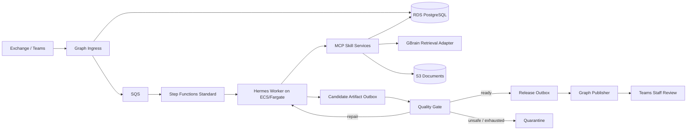

# Ava POC Implementation Blueprint

**Lea & Braze quote automation**  
**Version:** 1.0  
**Date:** August 13, 2026  
**Status:** Implementation baseline

## 1. Executive Summary

Ava will be implemented as an AWS-hosted, Hermes-backed agent for a bounded set of Lea & Braze quote workflows. The POC is intentionally production-shaped: it must preserve business state across failures, switch model providers without migrating knowledge, constrain tool use, evaluate every generated work product before staff can see it, and provide an immutable audit trail.

Hermes is Ava's agentic and conversational runtime. It interprets a bounded task, selects authorized skills, calls MCP tools, observes results, and returns a structured result. Hermes does not own business state, approvals, pricing rules, outbound permissions, or the release decision. Those responsibilities remain in Ava-controlled AWS services.

PostgreSQL is the system of record. S3 holds canonical documents. Step Functions coordinates the durable quote lifecycle. SQS isolates asynchronous work and failures. An Ava Quality Gate evaluates all model-generated Teams comments and artifacts. Only a separate Graph publisher can release approved output to Lea & Braze staff.

The POC does not autonomously contact customers. Fixed, versioned status acknowledgements may be sent to staff without model involvement. All model-generated content is gated.

## 2. Outcomes and Non-Negotiable Controls

### 2.1 POC outcomes

- Process the approved quote types, jurisdictions, and layouts represented in the POC evaluation set.
- Load at least 50 historical cases for evaluation and shadow 15-25 live inquiries, subject to client access and volume.
- Produce source-linked research, pricing recommendations, clarification questions, and quote drafts suitable for staff review.
- Demonstrate recovery from worker loss, duplicate events, provider failure, and temporary connector failure.
- Demonstrate model portability by changing the configured primary provider and replaying the holdout set without migrating knowledge or workflow data.
- Preserve a complete record of inputs, evidence, tool activity, artifact versions, evaluations, approvals, and delivery attempts.

### 2.2 Non-negotiable controls

- PostgreSQL is the sole authority for case state, approvals, artifact status, and audit history.
- Hermes and provider-hosted sessions are never authoritative.
- No model-generated output reaches Teams, email, or a review surface before the Quality Gate permits release.
- Hermes receives no direct Graph, Teams-send, or email-send capability.
- Customer communication always requires an explicit human decision and remains out of autonomous POC execution.
- Skills and learned memories cannot promote themselves during the POC.
- Observability failures cannot cause an unsafe release or block safe quarantine.

## 3. System Architecture



### 3.1 Responsibility boundaries

| Component | Owns | Must not own |
| --- | --- | --- |
| Hermes worker | Bounded reasoning, skill selection, tool loop, provider fallback | Case authority, approvals, direct delivery |
| RDS PostgreSQL | Cases, versions, evidence, pricing rules, artifacts, evaluations, audit | Large document binaries |
| S3 | Canonical documents, immutable source snapshots, generated files | Workflow transitions |
| Step Functions Standard | Stage coordination, retries, callback waits, time limits | Business payloads or authoritative state |
| SQS and DLQs | Event buffering, worker dispatch, failure isolation | Final status or approvals |
| MCP services | Validated tool execution and permission enforcement | Unbounded model-directed side effects |
| GBrain | Read-scoped retrieval over approved knowledge | Canonical knowledge or automatic memory promotion |
| Quality Gate | Validation, independent evaluation, repair decision, release policy | Teams delivery |
| Graph publisher | Idempotent delivery of released artifacts | Generation or release decisions |
| OpenTelemetry | Operational traces, metrics, and redacted diagnostics | Audit authority or release control |

## 4. Durable Workflow

### 4.1 Outer case lifecycle

The outer workflow is a durable state machine coordinated by Step Functions and committed in PostgreSQL. Step Functions carries only `case_id`, `expected_case_version`, `correlation_id`, and the current requested operation. Each worker reloads the case and performs an optimistic version check before changing it.

Recommended initial lifecycle:

`RECEIVED -> NORMALIZED -> COMPLETENESS_CHECKED -> RESEARCHED -> PRICED -> DRAFTED -> QUALITY_REVIEW -> READY_FOR_STAFF -> STAFF_REVIEW -> CLOSED`

Exceptional states are `WAITING_FOR_INPUT`, `RETRY_PENDING`, `QUARANTINED`, and `CANCELLED`. A case may enter an exceptional state from any processing stage, but every transition must be recorded as an append-only audit event.

### 4.2 Inner Hermes loop

One Hermes invocation handles one bounded reasoning stage:

1. Load the current case version, approved context, recent conversation, evidence references, model profile, and authorized skills.
2. Interpret the stage goal.
3. Select one authorized skill or return a terminal response.
4. Validate the proposed tool call against the skill schema and permissions.
5. Execute the MCP tool with an idempotency key.
6. Persist the tool request and observation.
7. Repeat until complete, blocked, failed, quarantined, or limited.

Each invocation is limited to eight tool iterations and a configured wall-clock deadline. It returns exactly one terminal status: `COMPLETED`, `NEEDS_HUMAN`, `RETRYABLE_FAILURE`, or `QUARANTINED`.

### 4.3 Checkpoint and retry rules

- Persist a checkpoint after every externally observable tool result.
- Use `(case_id, case_version, stage, operation_id)` as the idempotency scope.
- Reject stale workers whose expected case version no longer matches RDS.
- Retry only operations declared retry-safe by their skill definition.
- Store irreversible side-effect receipts before advancing the workflow.
- Send exhausted asynchronous failures to a DLQ and create an operator-visible incident record.
- Reconstruct a fresh Hermes session from RDS after loss; do not require persistent SQLite or EFS.

## 5. Core Contracts

All boundaries use Ava-owned, provider-neutral schemas. Provider thread IDs and native message objects may be retained as diagnostics but never as required state.

### 5.1 AgentTask

```json
{
  "case_id": "uuid",
  "expected_case_version": 12,
  "workflow_stage": "RESEARCHED",
  "authorized_skill_ids": ["property_research:v1", "pricing_lookup:v2"],
  "deadline_at": "2026-08-13T23:30:00Z",
  "correlation_id": "uuid",
  "context_snapshot_id": "uuid",
  "model_profile": "reasoning_primary"
}
```

### 5.2 AgentResult

```json
{
  "status": "COMPLETED",
  "structured_output": {},
  "evidence_refs": ["evidence:uuid"],
  "tool_audit_refs": ["tool-run:uuid"],
  "checkpoint_id": "uuid",
  "failure": null
}
```

### 5.3 CandidateArtifact

A candidate artifact records the immutable content, artifact type, source case version, source snapshot, prompt version, skill versions, generator model profile, evidence references, provenance, repair count, and gate status.

Artifact lifecycle:

`GENERATED -> VALIDATING -> REPAIRING -> READY_FOR_STAFF`

Any validation cycle may end in `QUARANTINED`. There is no direct transition from `GENERATED` to delivery.

### 5.4 ModelProfile

Each logical model role defines provider, model, region, capability requirements, data-handling policy, timeout, token limit, and ordered fallback profiles. Initial logical roles are:

- `reasoning_primary`
- `reasoning_fallback`
- `fast_extractor`
- `independent_critic`
- `embedding_default`

The registry is versioned and is the canonical model policy. Hermes configuration is generated from the relevant registry entries. Model calls outside Hermes use the same registry through an Ava `ModelGateway` interface.

### 5.5 QualityDecision

```json
{
  "artifact_id": "uuid",
  "artifact_version": 3,
  "policy_version": "quality-policy:v1",
  "hard_checks_passed": true,
  "critic_scores": {
    "groundedness": 0.95,
    "completeness": 0.93,
    "scope_accuracy": 0.94,
    "pricing_consistency": 1.0,
    "clarity": 0.92,
    "overall": 0.95
  },
  "defects": [],
  "repair_count": 0,
  "release_eligible": true
}
```

## 6. Data and Knowledge Design

### 6.1 PostgreSQL domains

The initial schema should separate these domains while retaining transactional relationships:

- `cases`, `case_events`, `case_checkpoints`, and `idempotency_keys`
- `messages`, `conversation_summaries`, and `tool_runs`
- `source_documents`, `source_snapshots`, `evidence_items`, and `provenance_links`
- `pricing_rules`, `jurisdiction_rules`, and effective-date histories
- `artifacts`, `artifact_versions`, `quality_decisions`, and `quality_checks`
- `approvals`, `reviewer_corrections`, `delivery_outbox`, and `delivery_attempts`
- `skill_definitions`, `skill_versions`, and `skill_permissions`
- `memory_candidates`, `approved_memories`, and promotion decisions
- `model_profiles`, `prompt_versions`, and evaluation runs

Use JSONB only for genuinely evolving payloads. Keep identifiers, statuses, effective dates, amounts, policy versions, and relationships typed and indexed.

### 6.2 Documents and evidence

- Store source and generated documents in encrypted, versioned S3 buckets.
- Store checksums, content type, source system, access policy, and S3 version ID in RDS.
- Snapshot the exact evidence used for each artifact so later source changes do not rewrite history.
- Use short-lived signed access and application-level authorization for document retrieval.
- Treat embeddings, OCR, parsing output, and retrieval indexes as derived data that can be rebuilt.

### 6.3 Memory and GBrain

The Ava Knowledge Store is RDS plus S3. GBrain is a replaceable, read-scoped retrieval adapter built from approved canonical content.

- Working memory: bounded Hermes context for one invocation.
- Conversation memory: normalized turns and decisions in RDS.
- Workflow memory: cases, checkpoints, approvals, and artifacts in RDS.
- Semantic knowledge: source-linked retrieval through GBrain, with SQL-first retrieval for structured facts.
- Pricing memory: typed, effective-dated RDS records; never vector-only memory.
- Procedural memory: versioned skills and MCP implementations.
- Learned memory: candidates awaiting evaluation and human approval.

Human corrections are stored as structured gold signals and become regression cases after review. No automatic memory promotion is allowed during the POC.

## 7. Skills and MCP Tooling

Every skill definition includes a version, purpose, input and output JSON Schemas, allowed workflow stages, required roles, bound MCP tools, timeout, side-effect class, retry policy, and idempotency behavior.

Initial skill set:

1. Normalize an inbound quote inquiry.
2. Assess completeness and identify clarification needs.
3. Retrieve property and jurisdiction evidence.
4. Retrieve effective pricing rules.
5. Assemble a source-linked research packet.
6. Draft a pricing recommendation.
7. Draft a quote artifact from an approved template.
8. Summarize staff feedback as a memory candidate.

Hermes may choose only from the skills listed in `AgentTask.authorized_skill_ids`. MCP servers independently enforce the same permissions. Discovery must not reveal unauthorized tools.

Side-effectful customer send tools are excluded from the Hermes runtime. Internal mutations use explicit capability scopes and idempotency keys.

## 8. Teams and Exchange Integration

### 8.1 Inbound path

1. Graph ingress validates the webhook and normalizes the event.
2. The event is deduplicated and committed to RDS before acknowledgement.
3. A fixed status template may be posted to staff through a narrowly scoped immediate path.
4. The case identifier is queued for workflow processing.
5. Hermes receives the normalized case through the controlled worker boundary, not through unrestricted platform tools.

### 8.2 Generated outbound path

The stock Hermes Teams delivery path must not publish generated content directly because an observer hook is not a reliable release control. Ava will use a custom Hermes platform adapter or controlled invocation bridge whose outbound operation writes a candidate artifact to RDS.

The Quality Gate evaluates that candidate. Only `READY_FOR_STAFF` artifacts are copied to the release outbox. A separate Graph publisher reads that outbox, performs an idempotent send, records the Graph receipt, and marks delivery complete.

### 8.3 Immediate status templates

Immediate messages are allowed only when all of the following are true:

- The content comes from a versioned, reviewed template.
- No model generated or modified the text.
- The message contains no pricing, conclusion, recommendation, or professional judgment.
- The template identifier and delivery receipt are audited.

Example: `Ava received this inquiry and has started the approved review workflow.`

## 9. Quality Gate

### 9.1 Validation sequence

1. Lock the candidate artifact version and set it to `VALIDATING`.
2. Run deterministic checks for schema, required fields, arithmetic, approved rates, template version, effective dates, source access, citation validity, jurisdiction consistency, unsupported conclusions, prompt-injection indicators, and outbound-action policy.
3. If hard checks pass, call an independent critic model using the artifact, evidence packet, pricing rules, and rubric. Do not provide generator hidden reasoning.
4. Apply the versioned policy in application code.
5. If repairable, create a targeted repair request and return the new immutable artifact version through the complete gate.
6. Release after a pass or quarantine after two failed repair attempts.

### 9.2 Initial release policy

- Every hard check passes.
- No critical or high-severity defect exists.
- Groundedness is at least `0.90`.
- Completeness is at least `0.90`.
- Overall score is at least `0.90`.
- The critic is independent of the generating model when available.
- If the critic is unavailable, semantic artifacts are quarantined rather than silently released.

### 9.3 Staff feedback

Store reviewer edits as structured corrections linked to the original artifact, evidence, model profile, prompt, and skill versions. Material corrections become regression tests after the live evaluation window. Staff sees released artifacts and concise validation status; quarantined artifacts and detailed traces are restricted to authorized POC operators.

## 10. AWS Deployment Topology

### 10.1 Compute and orchestration

- ECS/Fargate services for Graph ingress, Hermes workers, Quality Gate workers, and Graph publishing.
- Step Functions Standard for long-running quote orchestration and human callback waits.
- SQS queues between ingress, reasoning, validation, repair, and delivery stages, each with a DLQ.
- EventBridge for schedules and operational events where appropriate.

### 10.2 Data and security

- RDS PostgreSQL in private subnets with automated backups and point-in-time recovery.
- Versioned S3 buckets with KMS encryption, blocked public access, and lifecycle policies.
- Secrets Manager for Graph and model-provider credentials.
- KMS customer-managed keys for database, buckets, queues, and secrets where required.
- Least-privilege IAM task roles separated by service responsibility.
- Security groups that deny direct public database access.
- CloudTrail, VPC flow logs as required, and centralized application logs with retention controls.

### 10.3 Environment strategy

Maintain separate development and POC environments from the same infrastructure-as-code definitions. Configuration identifies the environment; code and schema behavior remain consistent. Production is a later promotion stage, not an alias for the POC environment.

The final IaC tool should match Lea & Braze IT standards. Until that is confirmed, architecture modules and resource boundaries remain tool-neutral. The accepted POC assumes AWS; any Azure requirement is a contract and architecture change requiring explicit resolution.

## 11. Observability and Evaluation Operations

Instrument workflow stages, model calls, fallback events, MCP calls, validation checks, repairs, quarantines, human corrections, delivery, cost, and latency with OpenTelemetry.

Export operational telemetry through an OpenTelemetry Collector to AWS-native monitoring. Telemetry should contain identifiers, hashes, durations, statuses, and redacted summaries by default; RDS and S3 retain authoritative client content and audit evidence.

Langfuse is optional. If introduced, self-host it inside the approved AWS boundary and use it for trace exploration, datasets, annotation, and experiment comparison. Langfuse never controls release and Ava must continue to operate safely when it is unavailable.

Initial operational alerts:

- DLQ depth greater than zero.
- Case without progress beyond its stage-specific threshold.
- Provider fallback rate above threshold.
- Critic unavailable or quarantine rate spike.
- Repeated optimistic concurrency conflicts.
- Delivery attempt exhaustion.
- Database, queue, or worker saturation.

## 12. Implementation Sequence

### Phase 0 - Reusable foundation before signature

- Finalize owned schemas and state transitions.
- Implement the model profile and skill registries.
- Build synthetic provider fallback and model-swap tests.
- Build local idempotency, checkpoint, and kill-and-resume proofs.
- Create Quality Gate policy fixtures with deliberately unsafe artifacts.
- Avoid client systems, credentials, and irreversible environment decisions.

This phase should remain a limited reusable investment. A hardened end-to-end vertical slice is expected to extend beyond the smallest pre-sign preparation window.

### Weeks 1-2 - Platform and access

- Resolve AWS/Azure, identity, networking, retention, and client-access decisions.
- Deploy baseline AWS infrastructure and CI/CD.
- Connect read-only Graph ingress and approved source repositories.
- Create RDS migrations, S3 document handling, queues, and audit foundations.
- Load the historical evaluation corpus with provenance.

### Weeks 3-4 - Bounded research workflow

- Integrate Hermes with the controlled worker boundary.
- Implement initial skills and MCP services.
- Deliver completeness, property research, jurisdiction, and evidence assembly stages.
- Prove provider fallback, worker recovery, and session reconstruction.

### Weeks 5-6 - Pricing, drafting, and Quality Gate

- Load approved pricing rules and effective dates.
- Generate pricing recommendations and quote drafts from controlled templates.
- Implement deterministic checks, independent critic, repair loop, and quarantine.
- Implement the gated Teams release outbox and staff review path.

### Weeks 7-8 - Shadow operation and acceptance

- Replay the historical development and holdout sets.
- Shadow the approved live inquiries without autonomous customer sends.
- Measure first-review acceptance, false passes, false failures, latency, cost, and recovery.
- Resolve critical defects, finalize runbooks, and present POC evidence.

## 13. Verification and Acceptance

### 13.1 Resilience tests

- Kill Hermes during a tool loop and resume from the last durable checkpoint without repeating side effects.
- Delete Hermes SQLite state and reconstruct the working session from RDS.
- Force the primary provider to fail and verify fallback without losing task context.
- Replay duplicate Graph events and Step Functions retries and verify one logical outcome.
- Exhaust connector retries and verify DLQ placement plus operator visibility.

### 13.2 Safety and quality tests

- Attempt direct outbound execution from Hermes and verify capability denial.
- Confirm generated content is absent from Teams until a release-eligible QualityDecision exists.
- Inject unsupported claims, stale rates, bad arithmetic, wrong jurisdictions, missing evidence, malformed tool responses, prompt-injected source text, and contradictory pricing.
- Fail the critic and verify semantic content is quarantined.
- Exhaust two repair attempts and verify quarantine.
- Require zero critical false passes on the untouched holdout set.

### 13.3 Portability and knowledge tests

- Change the primary model/provider and replay the evaluation set without data migration.
- Rebuild embeddings with a different embedding model while preserving canonical knowledge.
- Change prompt, skill, pricing, and source versions and verify cache invalidation.
- Verify an unauthorized identity cannot discover or execute restricted skills.

### 13.4 POC success evidence

- At least 80% of routine in-scope drafts are approval-ready on first review.
- Every released artifact has complete provenance and an immutable evaluation record.
- Recovery drills complete without lost authoritative state or duplicated side effects.
- Provider substitution requires configuration and conformance evaluation, not workflow or knowledge migration.
- No autonomous customer communication occurs.

## 14. Delivery Artifacts

- Infrastructure-as-code modules and environment configuration.
- Versioned PostgreSQL migrations and data dictionary.
- Hermes plugin or controlled invocation bridge.
- MCP skill services and skill registry.
- Model profile registry and provider conformance tests.
- Quality Gate policies, critic schemas, fixtures, and replay harness.
- Graph ingress and gated publisher services.
- Historical evaluation corpus manifest and holdout controls.
- Operational dashboards, alarms, recovery runbooks, and access matrix.
- POC results report with quality, recovery, latency, and cost evidence.

## 15. Dependencies, Risks, and Decisions Required

| Item | Impact | Required resolution |
| --- | --- | --- |
| AWS versus Azure wording | Changes deployment and security design | Confirm AWS in the signed SOW and IT response |
| Graph and Teams permissions | Blocks real ingress and staff delivery | John/IT approves least-privilege app scopes and test identities |
| SMB/DFS and Monday access | Limits source coverage | Confirm read-only paths, credentials, and sample data |
| Approved quote scope | Unbounded acceptance risk | Freeze quote types, jurisdictions, and layouts in the test-set manifest |
| Pricing authority | Unsafe or stale recommendations | Name the owner and define effective-date/change approval process |
| Staff reviewers | Delays calibration and acceptance | Name primary and backup reviewers with response expectations |
| Data retention and model policy | May restrict providers or traces | Approve region, retention, redaction, and provider data-handling rules |
| Hermes version pinning | Runtime drift | Pin and test an approved version; upgrade only through replay gates |

## 16. Final Architecture Decisions

1. Hermes is Ava's primary agentic runtime, not an optional helper.
2. PostgreSQL and S3 preserve knowledge and business state independently of Hermes and model providers.
3. Step Functions coordinates work but never becomes the system of record.
4. GBrain is a rebuildable retrieval adapter, not the canonical memory store.
5. The Quality Gate is implemented in Ava application code and is the only path to release generated content.
6. A separate Graph publisher delivers only artifacts already marked `READY_FOR_STAFF`.
7. Fixed non-model status templates may bypass semantic evaluation but remain versioned and audited.
8. Skills, prompts, policies, model profiles, and memories are versioned and require controlled promotion.
9. Redis/Valkey and provider prompt caches are disposable optimizations only.
10. Langfuse may improve evaluation operations but is not required for correctness or safety.

---

This document is the implementation baseline for the Ava POC. Changes to authority boundaries, outbound permissions, quality thresholds, hosting platform, or approved workflow scope require an explicit architecture decision and corresponding acceptance-test update.
